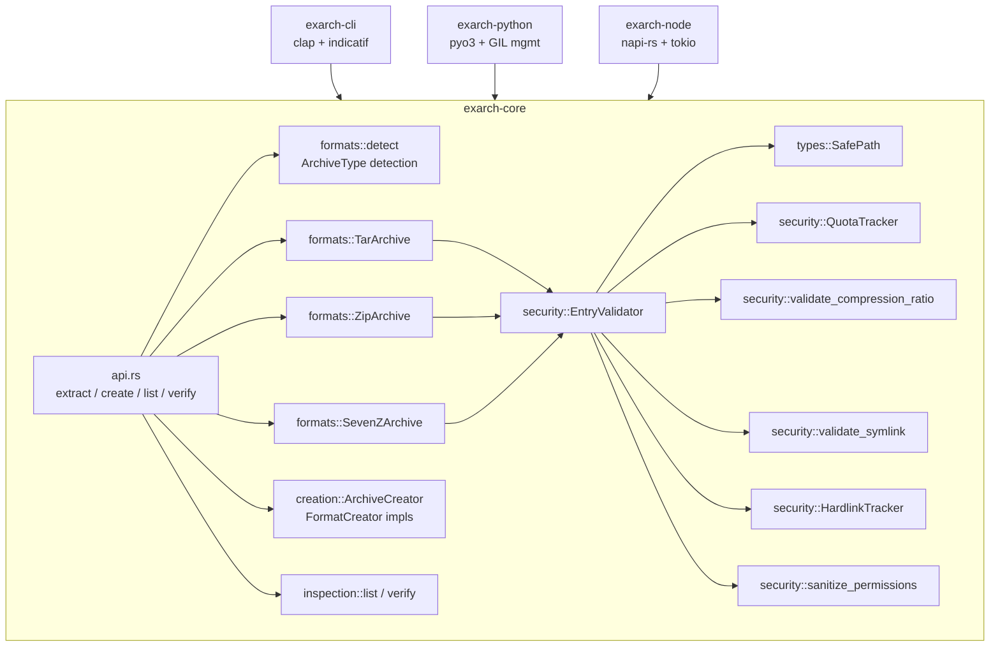

---
aliases:
  - exarch Technical Plan
tags:
  - sdd
  - plan
  - archive
  - security
  - rust
created: 2026-05-20
status: draft
related:
  - "[[spec]]"
  - "[[constitution]]"
  - "[[MOC-specs]]"
---

# Technical Plan: exarch System

> [!info] References
> **Spec**: [[spec]]
> **Version**: 0.3.1

## 1. Architecture

### Approach

Four-crate workspace where all logic lives in `exarch-core`. The three
consumer crates (`exarch-cli`, `exarch-python`, `exarch-node`) are thin
adapters that convert types and dispatch to the core library.

The core library is organized around a typed security pipeline: raw archive
bytes are never written to disk until an entry passes the full validation
chain. Format handlers implement the `ArchiveFormat` trait, which enforces
a uniform extract/list/verify interface regardless of underlying format.

### Component Diagram



### Key Design Decisions

| Decision | Choice | Rationale | Alternatives Considered |
|----------|--------|-----------|------------------------|
| Security pipeline ordering | path → quota → compression ratio → type-specific | Cheap checks first; fail fast before I/O | Post-write validation (rejected: leaves partial output) |
| `SafePath` as newtype | Cannot be constructed without passing validation | Type-safe guarantee that a path is safe | Runtime flag on `PathBuf` (rejected: not statically enforced) |
| `EntryValidator` holds references | `&SecurityConfig`, `&DestDir` | No cloning per entry; measurable perf benefit | Clone per entry (rejected: measurable overhead at 10k+ files) |
| 7z creation unsupported | Return `UnsupportedFormat` | `sevenz-rust2` write support is experimental | Expose write path (deferred: correctness risk) |
| ZIP-family aliases rejected for creation | Return `InvalidArchive` with explanation | Silently producing a bare ZIP with `.apk` extension is misleading | Allow it silently (rejected: would confuse callers expecting valid APK structure) |
| Atomic extraction via temp-dir + rename | `ExtractionOptions::atomic` | All-or-nothing semantics on same filesystem | Copy-then-delete (rejected: not atomic) |
| Deny-by-default for symlinks/hardlinks | `AllowedFeatures` all false | Defense in depth; explicit opt-in | Allow-by-default (rejected: too many CVE-pattern escapes) |
| Solid 7z rejection by default | `allow_solid_archives: false` | Memory exhaustion risk; decompresses entire block | Per-file limit (insufficient: solid block ignores per-file granularity) |

## 2. Project Structure

```
exarch/
├── Cargo.toml                          # workspace definition
├── CHANGELOG.md
├── tests/
│   └── fixtures/                       # shared test archives (simple.7z, etc.)
└── crates/
    ├── exarch-core/
    │   ├── src/
    │   │   ├── lib.rs                  # re-exports; module declarations
    │   │   ├── api.rs                  # extract_archive, create_archive, list_archive, verify_archive
    │   │   ├── archive.rs              # Archive, ArchiveBuilder (high-level builder API)
    │   │   ├── config.rs               # SecurityConfig, ExtractionOptions, AllowedFeatures
    │   │   ├── report.rs               # ExtractionReport, ProgressCallback, NoopProgress
    │   │   ├── error/
    │   │   │   ├── mod.rs
    │   │   │   ├── types.rs            # ExtractionError enum
    │   │   │   └── messages.rs         # FfiErrorMessage for FFI-safe error passing
    │   │   ├── formats/
    │   │   │   ├── mod.rs              # re-exports TarArchive, ZipArchive, SevenZArchive
    │   │   │   ├── traits.rs           # ArchiveFormat, FormatCreator traits
    │   │   │   ├── detect.rs           # detect_format(), ArchiveType enum, ZIP_FAMILY_ALIASES
    │   │   │   ├── common.rs           # DirCache (avoid redundant canonicalize syscalls)
    │   │   │   ├── compression.rs      # shared compression helpers
    │   │   │   ├── tar.rs              # TarArchive<R: Read> impl ArchiveFormat
    │   │   │   ├── zip.rs              # ZipArchive impl ArchiveFormat
    │   │   │   └── sevenz.rs           # SevenZArchive impl ArchiveFormat
    │   │   ├── security/
    │   │   │   ├── mod.rs
    │   │   │   ├── context.rs          # ValidationContext (per-entry state, dir_cache ref)
    │   │   │   ├── path.rs             # validate_path() → SafePath
    │   │   │   ├── symlink.rs          # validate_symlink() → SafeSymlink
    │   │   │   ├── hardlink.rs         # HardlinkTracker
    │   │   │   ├── quota.rs            # QuotaTracker (file count, bytes)
    │   │   │   ├── zipbomb.rs          # validate_compression_ratio()
    │   │   │   ├── permissions.rs      # sanitize_permissions() (Unix only)
    │   │   │   └── validator.rs        # EntryValidator orchestrator, ValidatedEntry
    │   │   ├── types/
    │   │   │   ├── mod.rs
    │   │   │   ├── safe_path.rs        # SafePath newtype
    │   │   │   ├── safe_symlink.rs     # SafeSymlink newtype
    │   │   │   ├── entry_type.rs       # EntryType enum (File, Directory, Symlink, Hardlink)
    │   │   │   └── dest_dir.rs         # DestDir (canonicalized output directory)
    │   │   ├── creation/
    │   │   │   ├── mod.rs              # re-exports creators, CreationConfig, CreationReport
    │   │   │   ├── config.rs           # CreationConfig
    │   │   │   ├── creator.rs          # ArchiveCreator
    │   │   │   ├── tar.rs              # TarCreator, TarGzCreator, TarBz2Creator, TarXzCreator, TarZstCreator
    │   │   │   ├── zip.rs              # ZipCreator
    │   │   │   ├── compression.rs      # compression level helpers
    │   │   │   ├── filters.rs          # file filtering (exclude patterns, hidden files)
    │   │   │   ├── progress.rs         # progress helpers for creation
    │   │   │   ├── report.rs           # CreationReport
    │   │   │   └── walker.rs           # directory walking (walkdir wrapper)
    │   │   ├── inspection/
    │   │   │   ├── mod.rs
    │   │   │   ├── list.rs             # list_archive() per format
    │   │   │   ├── verify.rs           # verify_archive() + verify_manifest()
    │   │   │   ├── manifest.rs         # ArchiveManifest, ArchiveEntry, ManifestEntryType
    │   │   │   └── report.rs           # VerificationReport, VerificationIssue, etc.
    │   │   ├── io/
    │   │   │   ├── mod.rs
    │   │   │   └── counting.rs         # CountingWriter (tracks bytes written for progress)
    │   │   ├── copy.rs                 # CopyBuffer (reusable buffer for file I/O)
    │   │   └── test_utils.rs           # shared test helpers
    │   └── benches/
    │       ├── creation.rs
    │       ├── extraction.rs
    │       ├── validation.rs
    │       └── progress.rs
    ├── exarch-cli/
    │   └── src/
    │       ├── main.rs                 # arg parsing, dispatch
    │       ├── cli.rs                  # clap structs (Cli, Commands, ExtractArgs, etc.)
    │       ├── error.rs                # CLI error type, exit code mapping
    │       ├── progress.rs             # indicatif-based ProgressCallback impl
    │       ├── commands/
    │       │   ├── extract.rs
    │       │   ├── create.rs
    │       │   ├── list.rs
    │       │   ├── verify.rs
    │       │   └── completion.rs
    │       └── output/
    │           ├── formatter.rs        # OutputFormatter trait
    │           ├── human.rs            # human-readable text output
    │           └── json.rs             # JSON output (serde_json)
    ├── exarch-python/
    │   └── src/
    │       ├── lib.rs                  # pymodule, pyfunction wrappers, path_to_string
    │       ├── config.rs               # PySecurityConfig, PyCreationConfig
    │       ├── error.rs                # convert_error(), register_exceptions()
    │       └── report.rs               # PyExtractionReport, PyCreationReport, etc.
    └── exarch-node/
        └── src/
            ├── lib.rs                  # #[napi] async functions
            ├── config.rs               # SecurityConfig, CreationConfig JS classes
            ├── error.rs                # convert_error()
            ├── report.rs               # ExtractionReport, CreationReport, etc. JS types
            └── utils.rs                # validate_path() for Node boundary checks
```

## 3. Data Model

### Security Pipeline Types

```rust
// Entry type classification — raw, before validation
pub enum EntryType {
    File,
    Directory,
    Symlink { target: PathBuf },
    Hardlink { target: PathBuf },
}

// After full validation; can only be constructed inside security module
pub struct SafePath(PathBuf); // invariant: no traversal, within dest, depth ok

pub struct SafeSymlink(PathBuf); // invariant: target resolves within dest

pub struct ValidatedEntry {
    pub safe_path: SafePath,
    pub entry_type: ValidatedEntryType,
    pub mode: Option<u32>,          // sanitized (setuid/setgid stripped)
}

pub enum ValidatedEntryType {
    File,
    Directory,
    Symlink(SafeSymlink),
    Hardlink { target: SafePath },
}
```

### SecurityConfig Defaults

| Field | Default |
|-------|---------|
| `max_file_size` | 50 MB |
| `max_total_size` | 500 MB |
| `max_compression_ratio` | 100.0× |
| `max_file_count` | 10,000 |
| `max_path_depth` | 32 |
| `allowed.symlinks` | false |
| `allowed.hardlinks` | false |
| `allowed.absolute_paths` | false |
| `allowed.world_writable` | false |
| `preserve_permissions` | false |
| `allowed_extensions` | [] (all allowed) |
| `banned_path_components` | `.git`, `.ssh`, `.gnupg`, `.aws`, `.kube`, `.docker`, `.env` |
| `allow_solid_archives` | false |
| `max_solid_block_memory` | 512 MB |

### ArchiveType Detection Rules

| Extension(s) | ArchiveType |
|---|---|
| `.tar` | `Tar` |
| `.tar.gz`, `.tgz` | `TarGz` |
| `.tar.bz2`, `.tbz`, `.tbz2` | `TarBz2` |
| `.tar.xz`, `.txz` | `TarXz` |
| `.tar.zst`, `.tzst` | `TarZst` |
| `.zip` | `Zip` |
| `.jar`, `.war`, `.ear`, `.nar`, `.nbm`, `.apk`, `.aab`, `.ipa`, `.appx`, `.msix`, `.whl`, `.vsix`, `.xpi`, `.epub` | `Zip` (extraction) / error (creation) |
| `.7z` | `SevenZ` |
| `.gz` (no `.tar` stem) | Error: `UnsupportedFormat` |
| anything else | Error: `UnsupportedFormat` |

> [!note]
> Detection is extension-based, case-insensitive. Magic byte detection is NOT currently implemented — format is inferred from the file extension only.

## 4. API Design

### Rust Public API (exarch-core)

```rust
// Extraction
pub fn extract_archive<P, Q>(archive: P, output: Q, config: &SecurityConfig)
    -> Result<ExtractionReport>;

pub fn extract_archive_with_progress<P, Q>(archive: P, output: Q, config: &SecurityConfig,
    progress: &mut dyn ProgressCallback) -> Result<ExtractionReport>;

pub fn extract_archive_with_options<P, Q>(archive: P, output: Q, config: &SecurityConfig,
    options: &ExtractionOptions) -> Result<ExtractionReport>;

pub fn extract_archive_with_options_and_progress<P, Q>(archive: P, output: Q,
    config: &SecurityConfig, options: &ExtractionOptions,
    progress: &mut dyn ProgressCallback) -> Result<ExtractionReport>;

// Creation
pub fn create_archive<P, Q>(output: P, sources: &[Q], config: &CreationConfig)
    -> Result<CreationReport>;

pub fn create_archive_with_progress<P, Q>(output: P, sources: &[Q], config: &CreationConfig,
    progress: &mut dyn ProgressCallback) -> Result<CreationReport>;

// Inspection
pub fn list_archive<P>(archive: P, config: &SecurityConfig) -> Result<ArchiveManifest>;
pub fn verify_archive<P>(archive: P, config: &SecurityConfig) -> Result<VerificationReport>;
```

### ProgressCallback Trait

```rust
pub trait ProgressCallback: Send {
    fn on_entry_start(&mut self, path: &Path, total: usize, current: usize);
    fn on_bytes_written(&mut self, bytes: u64);
    fn on_entry_complete(&mut self, path: &Path);
    fn on_complete(&mut self);  // NOT called on failure
}
```

### ArchiveFormat Trait

```rust
pub trait ArchiveFormat {
    fn extract(&mut self, output_dir: &Path, config: &SecurityConfig,
        options: &ExtractionOptions, progress: &mut dyn ProgressCallback)
        -> Result<ExtractionReport>;
    fn list(&mut self, config: &SecurityConfig) -> Result<ArchiveManifest>;
    fn verify(&mut self, config: &SecurityConfig) -> Result<VerificationReport>;
    fn format_name(&self) -> &'static str;
}

pub trait FormatCreator {
    fn create(&self, output: &Path, sources: &[&Path], config: &CreationConfig,
        progress: &mut dyn ProgressCallback) -> Result<CreationReport>;
    fn format_name(&self) -> &'static str;
}
```

### CLI Commands

```
exarch [--verbose] [--quiet] [--json] <COMMAND>

exarch extract <ARCHIVE> [OUTPUT_DIR]
    [--max-files N] [--max-total-size SIZE] [--max-file-size SIZE]
    [--max-compression-ratio N] [--allow-symlinks] [--allow-hardlinks]
    [--allow-solid-archives] [--allow-world-writable]
    [--preserve-permissions] [--force] [--atomic]

exarch create <OUTPUT> <SOURCE>...
    [-l/--compression-level 1-9] [--follow-symlinks] [--include-hidden]
    [-x/--exclude PATTERN]... [--strip-prefix PREFIX] [-f/--force]

exarch list <ARCHIVE>
    [-l/--long] [-H/--human-readable]
    [--max-files N] [--max-total-size SIZE] [--allow-solid-archives]

exarch verify <ARCHIVE>
    [--check-integrity] [--check-security]
    [--max-files N] [--max-total-size SIZE] [--allow-solid-archives]

exarch completion <SHELL>    # bash | zsh | fish | powershell | elvish
```

### Python API

```python
# Module: exarch

def extract_archive(archive_path, output_dir, config=None) -> ExtractionReport
def create_archive(output_path, sources, config=None) -> CreationReport
def create_archive_with_progress(output_path, sources, config=None, progress=None) -> CreationReport
def list_archive(archive_path, config=None) -> ArchiveManifest
def verify_archive(archive_path, config=None) -> VerificationReport

class SecurityConfig:
    def max_file_size(self, size: int) -> SecurityConfig
    def max_total_size(self, size: int) -> SecurityConfig
    def allow_symlinks(self, allow: bool) -> SecurityConfig
    # ... etc

class CreationConfig:
    def compression_level(self, level: int) -> CreationConfig
    # ... etc

# Exception hierarchy
ExarchError(Exception)
  PathTraversalError(ExarchError)
  SymlinkEscapeError(ExarchError)
  HardlinkEscapeError(ExarchError)
  ZipBombError(ExarchError)
  QuotaExceededError(ExarchError)
  UnsupportedFormatError(ExarchError)
  InvalidArchiveError(ExarchError)
  SecurityViolationError(ExarchError)
  InvalidPermissionsError(ExarchError)
```

### Node.js API

```typescript
// All functions are async (Promise-based)
function extractArchive(archivePath: string, outputDir: string,
    config?: SecurityConfig): Promise<ExtractionReport>

function createArchive(outputPath: string, sources: string[],
    config?: CreationConfig): Promise<CreationReport>

function listArchive(archivePath: string,
    config?: SecurityConfig): Promise<ArchiveManifest>

function verifyArchive(archivePath: string,
    config?: SecurityConfig): Promise<VerificationReport>

class SecurityConfig {
    maxFileSize(size: number): this
    maxTotalSize(size: number): this
    allowSymlinks(allow: boolean): this
    // ... etc
}
```

## 5. Integration Points

| System | Direction | Protocol | Notes |
|--------|-----------|----------|-------|
| Filesystem | outbound | OS syscalls | Extraction writes via `std::fs`; atomic mode uses `tempfile` + `fs::rename` |
| Python runtime | inbound | FFI (pyo3) | GIL released during I/O when no progress callback; `PyProgressAdapter` holds GIL via `Python::attach` |
| Node.js runtime | inbound | FFI (napi-rs) | Operations run on libuv thread pool via `tokio::task::spawn_blocking` equivalent |
| `sevenz-rust2` crate | outbound | Rust API | External crate for 7z parsing; solid block detection depends on its API surface |
| `zip` crate | outbound | Rust API | ZIP reading/writing; `ZipArchive` and `ZipWriter` types |
| `tar` crate | outbound | Rust API | TAR reading; `Archive<R>` generic over decompressor |

## 6. Security

The security architecture is described in full in [[spec#3. Functional Requirements]].
Key implementation notes:

**Path validation** (`security/path.rs`): Uses `PathBuf::components()` to detect
`..` without calling `canonicalize()` for each entry (expensive). `canonicalize()`
is called only when a symlink has been seen previously (tracked by `symlink_seen`
flag in `EntryValidator`). `DirCache` caches directories created by the extractor
to skip `canonicalize()` for known-safe parents.

**Quota tracking** (`security/quota.rs`): `QuotaTracker` accumulates file count and
total bytes. Checked before writing each entry. Not reversible — once exceeded,
extraction halts.

**Compression ratio** (`security/zipbomb.rs`): Ratio computed as
`uncompressed_size / compressed_size`. Only checked when `compressed_size` is
known (ZIP has it in the local file header; TAR compressed streams do not expose
it per-entry, so zip bomb detection is format-dependent).

**Permission sanitization** (`security/permissions.rs`): On Unix, `mode & !0o6000`
strips setuid/setgid. World-writable check (`mode & 0o002`) can raise an error if
`allowed.world_writable` is false.

**Solid 7z** (`formats/sevenz.rs`): Pre-validates total uncompressed size of all
entries against `max_solid_block_memory` before extraction begins. Conservative
heuristic: assumes single solid block (actual block boundaries not exposed by
`sevenz-rust2` v0.21).

## 7. Testing Strategy

| Level | Framework | What to Test | Notes |
|-------|-----------|-------------|-------|
| Unit | `cargo test` / nextest | Individual security checks, config validation, path parsing | Per-module in `#[cfg(test)]` blocks |
| Property | `proptest` | Path traversal variants, arbitrary archive entry paths | In `security/path.rs`, `security/symlink.rs` |
| Integration | nextest + fixture archives | Full extract/create/list/verify cycles per format | `tests/` directory; fixture archives in `tests/fixtures/` |
| Benchmark | `criterion` | Extraction throughput, creation throughput, validation overhead, progress overhead | `exarch-core/benches/`; run with `cargo bench -p exarch-core` |
| Memory profiling | `dhat` | Heap allocation patterns during extraction | `exarch-core/benches/` |
| Python | `pytest` + `maturin develop` | Python API, GIL behavior, error mapping | `exarch-python/tests/` |
| Node.js | `npm test` | Async Promise API, error mapping | `exarch-node/` |

> [!warning]
> Windows path separator handling (`\` vs `/`) is a known edge case in path validation. Ensure a Windows CI job exists before merging any path-related change.

## 8. Performance Considerations

- **Expected extraction scale**: archives with up to 10,000 files and 500 MB uncompressed at a time (matching default quota limits)
- **Bottlenecks**: decompression CPU-bound for xz/bz2; I/O-bound for gz/zst; 7z solid archives decompress entire block into memory before writing
- **`BufReader`**: wraps all TAR file handles to reduce syscall count
- **`CopyBuffer`**: reusable buffer in `copy.rs` for file I/O; avoids per-entry allocations
- **`DirCache`**: avoids repeated `canonicalize()` for directory parents already created by the extractor
- **`EntryValidator` with references**: eliminates one `SecurityConfig` + `DestDir` clone per extraction call (measurable at high file counts)
- **`SmallVec`**: used in path component accumulation to avoid heap allocation for short paths

## 9. Rollout Plan

The system is already implemented at v0.3.1. This plan documents the current
architecture as a baseline for future feature work.

When adding new formats or changing security defaults:
1. Open a GitHub issue with P-label
2. Branch from `main` using naming convention
3. Implement + tests + benches (if performance-sensitive)
4. Pre-commit checks (see [[constitution]])
5. Update `CHANGELOG.md`
6. Open PR targeting `main`

## 10. Constitution Compliance

| Principle | Status | Notes |
|-----------|--------|-------|
| All security logic in exarch-core | Compliant | Bindings contain only type mapping and boundary validation |
| `deny(unsafe_code)` workspace-wide | Compliant | One justified exception: `unsafe impl Send for PyProgressAdapter` in Python bindings |
| Fluent builder APIs | Compliant | `SecurityConfig`, `CreationConfig`, `ExtractionOptions` all use `with_*` builders |
| `ProgressCallback::on_complete` not called on failure | Compliant | Verified by regression test (issue #170) |
| Deny-by-default security policy | Compliant | All `AllowedFeatures` flags false; `allow_solid_archives` false |
| MSRV 1.93.0 | Compliant | Checked in CI |
| Conventional Commits | Compliant | Enforced by PR review |
| `missing_docs` warning | Compliant | All public items documented |

## 11. Risks and Mitigations

| Risk | Impact | Probability | Mitigation |
|------|--------|-------------|------------|
| `sevenz-rust2` API change breaks 7z extraction | High | Medium | Pin version; track upstream releases |
| Solid 7z heuristic (assume single block) too conservative | Medium | Low | Revisit if `sevenz-rust2` exposes block boundaries in future |
| Windows path validation edge cases | High | Medium | Add Windows CI job; test `\` vs `/` separator handling |
| Python GIL + TOCTOU race on archive files | Medium | Low | Document accepted tradeoff; users must ensure exclusive access |
| New ZIP CVE in upstream `zip` crate | High | Low | Monitor RUSTSEC advisories via `cargo deny`; `rust-security-maintenance` agent runs after every change |
| Compression ratio check not available per-entry in TAR | Medium | High (already known) | Document limitation; quota check still limits total decompressed output |

## See Also

- [[spec]] — feature specification
- [[constitution]] — project principles
- [[MOC-specs]] — all specifications
