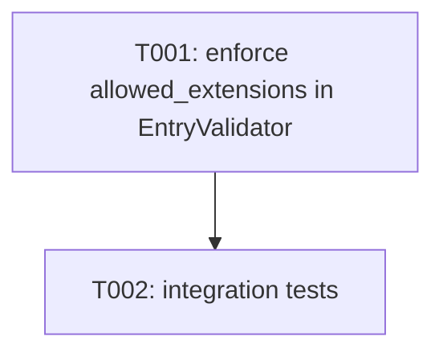

---
aliases:
  - Security Pipeline Tasks
tags:
  - sdd
  - tasks
  - security
  - rust
created: 2026-05-20
status: draft
related:
  - "[[spec]]"
  - "[[001-exarch-system/plan]]"
  - "[[constitution]]"
---

# Implementation Tasks: Security Pipeline

> [!info] References
> **Spec**: [[spec]]
> **Plan**: [[001-exarch-system/plan]]
> **Total tasks**: 2

> [!warning] Scope
> The security pipeline is substantially implemented. The only open gap is
> FR-011 / FR-013: `allowed_extensions` is defined in `SecurityConfig` but
> the `EntryValidator` never reads it, so extension filtering is silently
> skipped during extraction. GitHub issue #230 tracks this.

## Progress

- [ ] T001: Enforce `allowed_extensions` in `EntryValidator`
- [ ] T002: Add integration tests for extension filtering

---

## Dependency Graph

---

### T001: Enforce `allowed_extensions` in `EntryValidator`

**Context**: `SecurityConfig::allowed_extensions` is populated by callers and
exposed through the builder API, but `EntryValidator::validate()` never consults
it. As a result the field is silently ignored and FR-011 is unimplemented.
The fix is a single check inside `EntryValidator::validate()` after path
validation succeeds: if `allowed_extensions` is non-empty and the entry
extension (case-insensitive) is not in the list, return `Action::Skip`.
**Spec reference**: [[spec#FR-011]]
**GitHub issue**: #230
**Acceptance criteria**:
- [ ] `EntryValidator::validate()` reads `config.allowed_extensions` when the vec is non-empty
- [ ] Extension matching is case-insensitive (e.g. `.TXT` matches `"txt"`)
- [ ] Entries with no extension are skipped when `allowed_extensions` is non-empty
- [ ] Entries with an allowed extension are not affected
- [ ] When `allowed_extensions` is empty (default), behaviour is unchanged
- [ ] Unit tests in `security/validator.rs` cover the skip and allow paths
- [ ] `deny(unsafe_code)` still holds; no new `unsafe` blocks
**Dependencies**: none
**Files**:
- `crates/exarch-core/src/security/validator.rs` — add extension check in `validate()`
- `crates/exarch-core/src/security/context.rs` — check if `ValidationContext` needs extension data
**Complexity**: low

---

### T002: Integration tests for extension filtering

**Context**: Unit tests in `validator.rs` verify the skip logic in isolation.
Integration tests are needed to confirm that extraction through the full API
path (`extract_archive()` → format handler → `EntryValidator`) also honours the
filter, for both TAR and ZIP handlers.
**Spec reference**: [[spec#FR-011]], [[spec#SC-004]]
**GitHub issue**: #230
**Acceptance criteria**:
- [ ] Integration test: extract a TAR archive with `allowed_extensions = ["txt"]`; only `.txt` files appear in output directory
- [ ] Integration test: extract a ZIP archive with `allowed_extensions = ["rs"]`; only `.rs` files extracted
- [ ] Integration test: `allowed_extensions = []` (empty) extracts all files
- [ ] Tests use fixtures from `crates/exarch-core/tests/fixtures/` or create temp archives with `test_utils`
- [ ] All tests pass under `cargo nextest run -p exarch-core`
**Dependencies**: T001
**Files**:
- `crates/exarch-core/tests/` — new integration test file or extend existing extract tests
**Complexity**: low

---

## Implementation Notes

### Order of execution

T001 must land first; T002 is a follow-up that can be done in the same PR or
a separate one. Both are small enough for a single session each.

### Common patterns

- Look at `security/quota.rs` (`QuotaTracker`) and `security/path.rs` for how
  `SecurityConfig` fields are accessed inside `validate()`.
- Extension extraction: use `Path::extension()` and compare with
  `eq_ignore_ascii_case`.
- For the `Action::Skip` return path, follow the existing pattern used for
  `allowed.symlinks = false` in `validator.rs`.

### Gotchas

- Entries with no extension (`Path::extension()` returns `None`) must be treated
  as non-matching when `allowed_extensions` is non-empty.
- Extension comparison must strip the leading dot if `SecurityConfig` stores
  extensions without it (confirm by reading `with_allowed_extensions` doc-test).
- Do not call `to_lowercase()` on heap-allocated strings in the hot path; use
  `eq_ignore_ascii_case` instead (aligns with NFR-006 / NFR-002).

## See Also

- [[spec]] — feature specification
- [[001-exarch-system/plan]] — technical plan
- [[MOC-specs]] — all specifications
