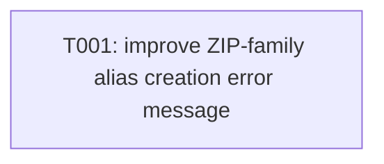

---
aliases:
  - Format Handlers Tasks
tags:
  - sdd
  - tasks
  - archive
  - rust
created: 2026-05-20
status: done
related:
  - "[[spec]]"
  - "[[001-exarch-system/plan]]"
  - "[[constitution]]"
---

# Implementation Tasks: Format Handlers

> [!info] References
> **Spec**: [[spec]]
> **Plan**: [[001-exarch-system/plan]]
> **Total tasks**: 1

> [!note] Completed in v0.4.0
> All format handler work is complete. The ZIP-family alias creation error
> message (FR-025 / #231) was improved in v0.4.0: the error now names the
> detected alias extension and references the `CreationConfig::format` override
> as the escape hatch.

## Progress

- [x] T001: Improve ZIP-family alias creation error message

---

## Dependency Graph

---

### T001: Improve ZIP-family alias creation error message

**Context**: `reject_zip_family_creation()` in `api.rs` already returns
`ArchiveError::InvalidArchive` when a caller tries to create an archive with
a ZIP-family alias extension (e.g. `.apk`, `.whl`) without an explicit
`CreationConfig::format` override. However the current error string does not
tell the user which extension was detected or how to bypass the guard. FR-025
says the error should contain "an explanatory message"; the spec acceptance
criterion requires a message that names the alias and the override.
**Spec reference**: [[spec#FR-025]], [[spec#US-003]]
**GitHub issue**: #231
**Acceptance criteria**:
- [ ] The `InvalidArchive` error message includes the detected alias extension (e.g. `.apk`)
- [ ] The message explains that the extension is a ZIP-family alias and creation is blocked by default
- [ ] The message references the `CreationConfig::format` override as the escape hatch
- [ ] Existing unit test `test_create_archive_zip_family_not_supported` is updated to assert the improved message content
- [ ] Existing test `test_create_archive_zip_family_override_bypasses_guard` continues to pass
- [ ] No behaviour change — only the error message text changes
**Dependencies**: none
**Files**:
- `crates/exarch-core/src/api.rs` — `reject_zip_family_creation()` function (line ~611)
**Complexity**: low

---

## Implementation Notes

### Order of execution

Single task; can be merged independently.

### Common patterns

- The existing error is constructed with `ArchiveError::InvalidArchive`.
  Extend the message string inline — no new error variant needed.
- Retrieve the extension from the `output` path argument already available in
  `reject_zip_family_creation()`.

### Gotchas

- `ArchiveError::InvalidArchive` carries a `String` message field; confirm
  the exact field name before editing.
- Keep the message concise — it will appear in CLI stderr output and in Python
  / Node.js `ExarchError` messages.

## See Also

- [[spec]] — feature specification
- [[001-exarch-system/plan]] — technical plan
- [[MOC-specs]] — all specifications
